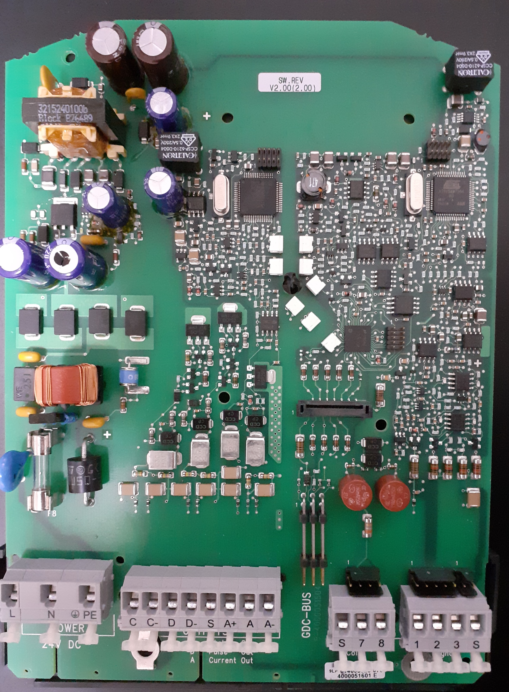
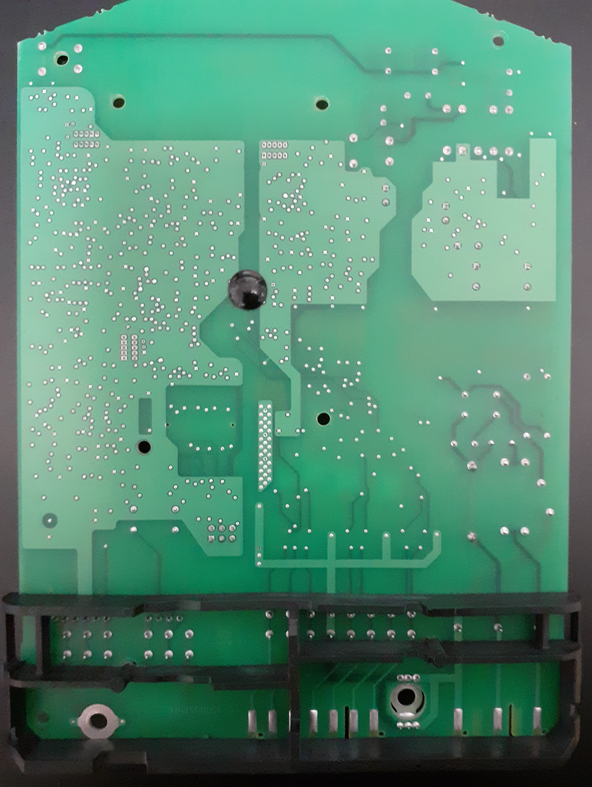

# Description

The Krohne IFC 100 is a Signal converter for an electromagnetic flow meter.

# Identification of the boards

The board is of revision ER2.0.3_.

Picture of the board top view:

Picture of the board bottom view:

# Description

The converter contains 1 board that houses the powersupply signal and output logic.

There are basically 3 versions of the converter with respect to the power supply:

* 24VAC/DC, AC: -15%/+10% DC: -25%/+30%
* 24VDC, -55%/+30% (so includes 12VDC +/-10% operation)
* 100-230VAC, -15%/+10% (so includes 240VAC +/-5% operation)

# Utilities used to create the drawings

The schematic diagram snippets are made with KiCad 6.0.11
